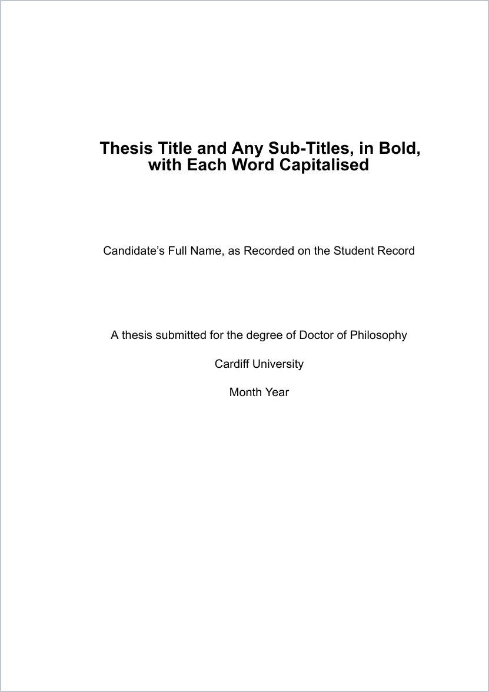
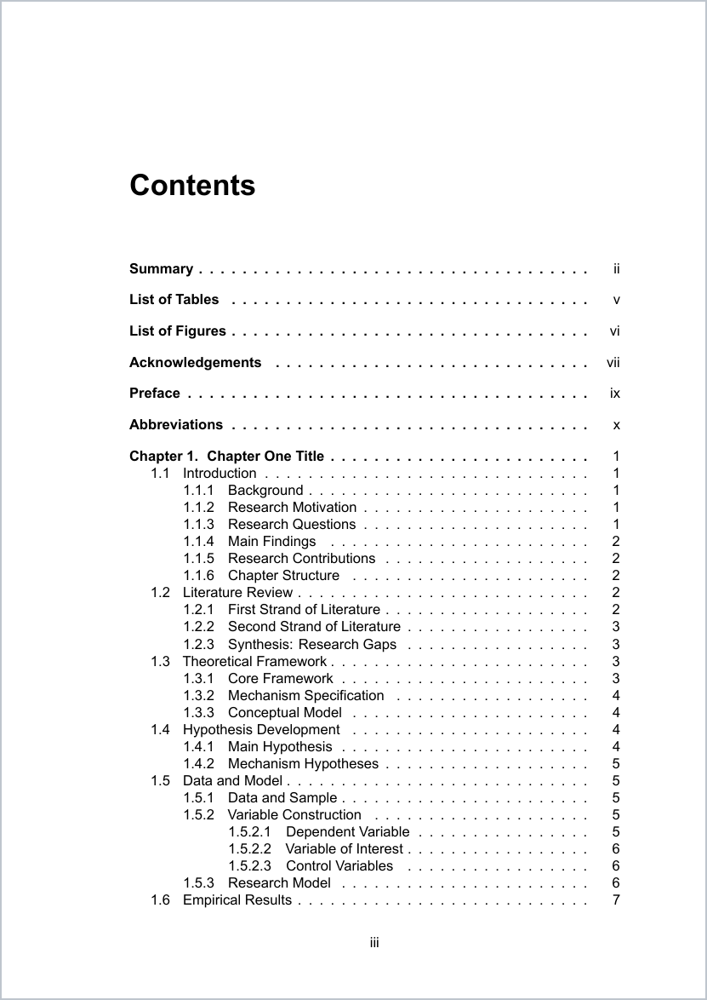
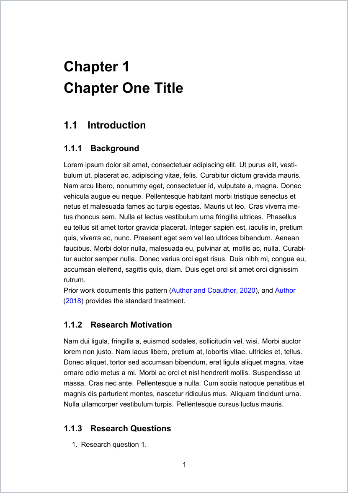
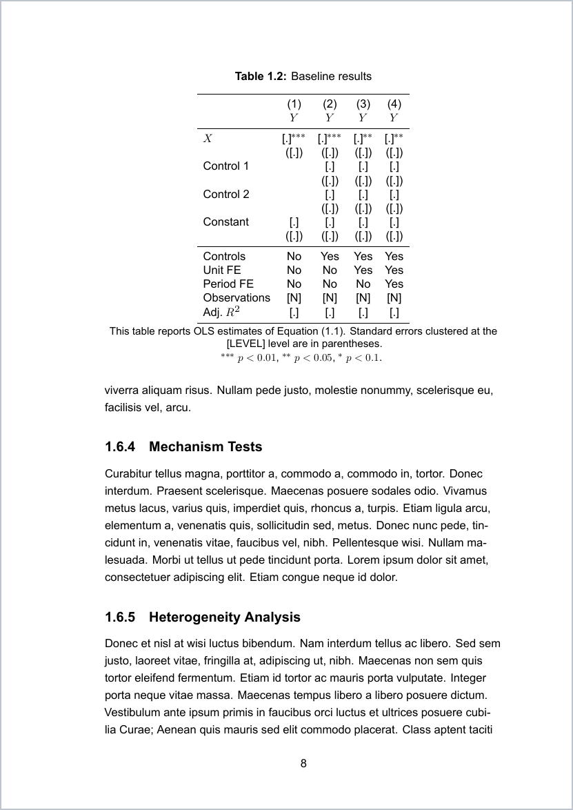

# Cardiff Business School PhD Thesis LaTeX Template

A LaTeX thesis template for **Cardiff University / Cardiff Business School** PhD
candidates, built for XeLaTeX and structured for a **paper-style (three-essay)
thesis** — though it works as well for a monograph.

The defaults follow Cardiff's [Policy on the Submission and Presentation of
Research Degree Theses][policy], with clause numbers cited inline in the source
so you can check each one yourself. Everything you personalise lives in one
metadata block at the top of `main.tex`.


[policy]: https://www.cardiff.ac.uk/__data/assets/pdf_file/0010/1467235/Submission-and-Presentation-of-Research-Degree-Theses.pdf

## What it produces

<table>
<tr>
<td width="25%"><a href="docs/preview/01-title.png"></a></td>
<td width="25%"><a href="docs/preview/02-contents.png"></a></td>
<td width="25%"><a href="docs/preview/03-chapter.png"></a></td>
<td width="25%"><a href="docs/preview/04-table.png"></a></td>
</tr>
<tr>
<td align="center"><sub><b>Title page</b><br>§5.3 &amp; §5.4 compliant</sub></td>
<td align="center"><sub><b>Contents</b><br>§5.2</sub></td>
<td align="center"><sub><b>Chapter opening</b><br>Arial, 1.5 spacing, left-aligned</sub></td>
<td align="center"><sub><b>Worked table</b><br>copy it for your own results</sub></td>
</tr>
</table>

Regenerate these with `./tools/preview.sh` after changing anything that alters
the output.

---

> **One gap you should know about.** §8 permits a "thesis with publication" and
> governs it through a *separate* document — *Guidance on the Inclusion of Papers
> and Published Work* — which is not on the public website. Since this template is
> shaped for a paper-style thesis, get that guidance from your PGR office and
> check the chapter structure and preface against it. Every other clause is
> cross-checked in [docs/POLICY-COMPLIANCE.md](docs/POLICY-COMPLIANCE.md).
>
> The policy is revised periodically and covers PhD, MD, EngD, professional
> doctorates and MPhil only (§1.1–1.2).

---

## Installation

Two routes. Overleaf needs nothing installed; a local install gives you a faster
edit-compile loop and works offline.

### Option A — Overleaf (no installation)

1. Download this repository as a zip: **Code → Download ZIP** on GitHub.
2. In Overleaf: **New Project → Upload Project**, and select the zip.
3. **Menu → Compiler → XeLaTeX**. This step is required — the template uses
   `fontspec` and `unicode-math`, which pdfLaTeX cannot compile.
4. **Menu → Main document → `main.tex`** if it is not already selected.

Overleaf has Arial available, so the font comes out as intended.

### Option B — Install locally

**1. Install a TeX distribution.**

*macOS.* MacTeX is the full distribution — around 5 GB, but everything this
template needs is included and you will not have to chase missing packages:

```bash
brew install --cask mactex
```

No Homebrew? Download the installer from [tug.org/mactex](https://tug.org/mactex/).
After installing, open a new terminal so `/Library/TeX/texbin` is on your `PATH`.

If disk space is tight, BasicTeX is about 100 MB, but you then install the
packages yourself:

```bash
brew install --cask basictex
sudo tlmgr update --self
sudo tlmgr install latexmk texcount collection-latexextra \
                   collection-fontsrecommended collection-mathscience
```

*Windows.* Install [MiKTeX](https://miktex.org/download), which fetches missing
packages on demand as you compile — accept the prompts the first time you build.
Tick "install packages on the fly" during setup. [TeX Live](https://tug.org/texlive/windows.html)
works too and is more self-contained.

*Linux (Debian/Ubuntu).* The full distribution is the least trouble:

```bash
sudo apt update && sudo apt install texlive-full
```

For a smaller install:

```bash
sudo apt install texlive-xetex texlive-latex-extra texlive-fonts-extra \
                 texlive-bibtex-extra texlive-science latexmk texcount
```

Arial is not present on most Linux systems. The template detects this and falls
back to TeX Gyre Heros, a metrically similar sans-serif face, so it still
compiles and still satisfies the §6.1 guidance.

**2. Get the template.**

```bash
git clone https://github.com/Jill0099/cardiff-business-school-phd-thesis-template.git
cd cardiff-business-school-phd-thesis-template
```

Prefer not to use git? **Code → Download ZIP** on GitHub, then unzip.

**3. Build it.**

```bash
latexmk main.tex
```

The PDF lands at `build/main.pdf`. First run takes a minute or so, since latexmk
compiles several times to resolve the contents list and cross-references.

**4. Check the install worked.**

```bash
./tools/wordcount.sh
```

You should see a count and the 80,000-word limit. If `texcount` is missing,
install it — it ships with TeX Live but BasicTeX omits it.

### Editor setup (optional)

The repository includes `.vscode/settings.json`, so if you use
[VS Code](https://code.visualstudio.com/) with the
[LaTeX Workshop](https://marketplace.visualstudio.com/items?itemName=James-Yu.latex-workshop)
extension, the XeLaTeX recipe and output directory are already configured —
open the folder and press **Ctrl/Cmd + Alt + B** to build.

For TeXShop, TeXworks or Texmaker, set the typesetting engine to **XeLaTeX**
and use `latexmk` if the option is offered.

### For the preview images only

`tools/preview.sh` needs two extras. You only need these if you want to
regenerate the images at the top of this page:

```bash
brew install poppler && pip3 install Pillow      # macOS
sudo apt install poppler-utils python3-pil        # Debian/Ubuntu
```

### If a build fails

| Symptom | Cause |
|---|---|
| `Package fontspec Error: The font "Arial" cannot be found` | Compiling with pdfLaTeX instead of XeLaTeX, or an old fontspec. Use `latexmk main.tex`, which forces XeLaTeX via `latexmkrc` |
| `File 'xyz.sty' not found` | Missing package. MiKTeX: accept the install prompt. TeX Live: `sudo tlmgr install xyz` |
| Contents list or cross-references show `??` | Not enough passes. `latexmk` handles this; if compiling by hand, run XeLaTeX, then BibTeX, then XeLaTeX twice |
| `texcount: command not found` | `sudo tlmgr install texcount` |
| Everything is stale after an edit | `latexmk -C` clears the build directory, then build again |

---

## Quick start

Once installed:

```bash
latexmk main.tex               # builds build/main.pdf
./tools/wordcount.sh           # counts against the 80,000-word limit
python3 tools/checkfonts.py    # verifies the 11pt floor (§6.3, §6.5)
```

Then edit the metadata block in `main.tex`:

```latex
\newcommand{\thesistitle}{Thesis Title and Any Sub-Titles, in Bold, with Each Word Capitalised}
\newcommand{\thesisauthor}{Candidate's Full Name, as Recorded on the Student Record}
\newcommand{\thesisdegree}{Doctor of Philosophy}
\newcommand{\thesisdate}{Month Year}
```

**On Overleaf:** upload the repository as a zip and set the compiler to
**XeLaTeX** in *Menu → Compiler*.

---

## What the policy actually requires

Every clause of the policy is cross-checked in
**[docs/POLICY-COMPLIANCE.md](docs/POLICY-COMPLIANCE.md)** — all fifteen sections
and three appendices, each marked as implemented, noted in the source, your
action, or not applicable, with the file that handles it. Audited against
**Version 8.0** (in effect 01.08.2025).

These are the points where a generic thesis template gets Cardiff wrong:

| Policy | Requirement | How the template handles it |
|---|---|---|
| §5.3 | The title page carries **five items only**: full title, degree award title, University name, month and year, and your full name as recorded on the student record | Reproduces the Appendix 3 template exactly. No department, school, supervisor or student number |
| §5.4 | "The title page must have a plain background. **No images should be used: this includes the University logo**" | No logo anywhere in the repo |
| §5.3.4 fn 3 | After corrections, the title page keeps the **original submission date** — not the date you hand in the corrected version | Noted on `\thesisdate` in `main.tex` |
| §6.1 | Font recommended for easy reading — **sans serif** such as Arial, Tahoma, Verdana — at **no less than 12 pt** | Arial by default, with a one-line switch back to Times |
| §6.2 | **Left-aligned, not justified**; spacing wide enough for accessibility, "e.g. 1.5" | `\RaggedRight` and `\onehalfspacing` |
| §6.3, §6.5 | All other text — footnotes, captions, **and characters inside tables and figures** — no smaller than 11 pt | `\footnotesize`, `\scriptsize` and `\tiny` redefined to 11 pt; maths script levels raised so table significance stars are legible. Verify with `python3 tools/checkfonts.py` |
| §6.4 | Roman then a single Arabic sequence; page numbers on **every page except the title page** | Title page opens the roman sequence as page i showing no number; no `\thispagestyle{empty}` on chapters |
| §5.1, §5.2, §5.6 | Required pages in order, then other lists, then optional pages | Assembled in that order; see `frontmatter/README.md` |
| §4.2, §4.3 | PhD **80,000 words**, excluding summary, acknowledgements, contents, appendices, tables and figures, references and footnotes | `tools/wordcount.sh`, with the exclusions encoded as TeXcount directives |

**There is no declaration page, and that is deliberate.** Appendix 1 is headed
"Statements and Declarations to be Signed by the Candidate and **Submitted loose
with the Thesis**" — a separate official form, not typeset into the thesis. The
word count goes on it too (§5.5). See
[`frontmatter/README.md`](frontmatter/README.md).

If you have seen older Cardiff theses with a bound-in declaration page, the
requirement changed.

---

## Word count

```
$ ./tools/wordcount.sh

  Counted (policy 4.3 exclusions)         261
  Limit (policy 4.2)                    80000
  Limit + 10% (policy 4.4)              88000

  Within the limit.

  Per chapter:
    chapters/chapter1.tex               226
    ...
```

Pass a different limit for another award — `./tools/wordcount.sh 50000` for
MPhil or a professional doctorate, `60000` for MD.

The exclusions in §4.3 are encoded in the source: `%TC:ignore` brackets the front
matter, appendices and bibliography, `%TC:macro \footnote [ignore]` drops
footnotes, and the TeXcount weights count body text and headings but not
captions, floats or maths. It is an estimate — agree the final figure with your
supervisor before it goes on the form.

---

## Repository layout

```
main.tex                 preamble, metadata block, document assembly
latexmkrc                build config (XeLaTeX + bibtex + nomenclature)
references.bib           bibliography
tools/wordcount.sh       word count against the policy limits
tools/checkfonts.py      verifies the 11pt floor in the built PDF
tools/preview.sh         regenerates the README preview images
docs/POLICY-COMPLIANCE.md  clause-by-clause audit against the policy
frontmatter/README.md    front-matter order, and why there is no declaration page
.vscode/settings.json    VS Code + LaTeX Workshop XeLaTeX recipe
frontmatter/
  titlepage.tex          Appendix 3 title page — do not add to it
  summary.tex            the required summary, max 300 words
  acknowledgements.tex
  dedication.tex         optional
  preface.tex            optional; co-authorship for a paper-style thesis
  abbreviations.tex      acronym list; use \ac{KEY} in the text
  nomenclature.tex       symbol list; off by default
chapters/
  chapter1.tex           full empirical chapter skeleton (see below)
  chapter2-6.tex         stubs, same shape as chapter 1
  appendix.tex           variable definitions + supplementary results
```

---

## What chapter 1 gives you

`chapters/chapter1.tex` is laid out as a complete empirical study, so it doubles
as a skeleton for any paper-style chapter:

| Section | What goes there |
|---|---|
| Introduction | background, motivation, research questions, findings, contributions, roadmap |
| Literature Review | strands of prior work, then a synthesis naming the gap |
| Theoretical Framework | core framework, mechanism, and a TikZ conceptual diagram |
| Hypothesis Development | hypotheses stated with their predicted signs |
| Data and Model | sample, variable construction, the estimating equation |
| Empirical Results | descriptives, baseline, identification, mechanism, heterogeneity, robustness |
| Conclusion | findings, implications, limitations |

It ships with two worked exhibits to copy: a **descriptive statistics table** and
a **four-column regression table** with a fixed-effects ladder, clustered
standard errors in parentheses and significance stars — both `booktabs`, with
placeholder cells (`[.]`, `[N]`) rather than numbers.

The comments in the file are prompts about what belongs in each section. Delete
them as you write.

---

## Other features

- **Graceful font fallback.** Arial if installed, otherwise TeX Gyre Heros, then
  DejaVu Sans — so it compiles anywhere, including on CI.
- **Serif switch.** Set `\usesansfontfalse` in `main.tex` for Times New Roman.
  §6.1 is a recommendation, not a prohibition, and serif faces remain common in
  Business School theses — ask your supervisor.
- **Optional CJK support** via `xeCJK`, commented out in the preamble.
- **`subfiles`.** `latexmk chapters/chapter3.tex` builds that chapter alone, with
  the right chapter number, while the full thesis still builds from `main.tex`.
- **Harvard referencing** (`agsm` via `natbib`), the usual Cardiff Business
  School choice. Confirm with your supervisor.
- **`cleveref`** for `\cref{}` cross-references.
- **CI build** on every push.

---

## Licence

[MIT](LICENSE). Use it for your thesis, no attribution required.

Not an official Cardiff University template, and not affiliated with or endorsed
by the University. The policy is the authority; this is a convenience.
